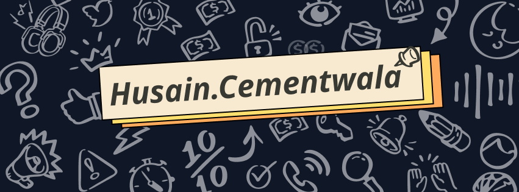

# Welcome to My GitHub Profile! 

---

---

## About Me 

Hello! I'm [Your Name], a passionate **developer**, **designer**, and **problem solver**. Whether it's crafting creative designs, writing clean code, or brainstorming innovative solutions, I'm always ready to dive in and make an impact.

- 💻 **Current Focus**: Building a **color mixer app** using HTML, CSS, and JavaScript.
- 📚 **Skills**: JavaScript, Python, HTML/CSS, Cryptography, Network Security.
- 🎨 **Hobbies**: Graphic design, parody video creation, and writing research papers.
- 🎓 **UPSC Aspirant** with Sociology as my optional subject.

---

## My Projects

### Color Mixer App 
- **Details**: Allows users to upload images, extract colors, and receive instructions to replicate those shades.
- **Technology Stack**: HTML, CSS, JavaScript.
- 🌟 [View Project](https://github.com/yourusername/color-mixer)

### SKYFAIL: A Parody Video
- **Details**: A humorous take on unprepared students during exams, inspired by Adele's *Skyfall*.
- 🌟 [View Video](https://youtube.com/yourvideo)

### Image Encryption Model
- **Details**: Combines AES, RSA, and chaotic maps to create a novel encryption mechanism.
- 🌟 [Read Research](https://github.com/yourusername/encryption-research)

---

## Connect with Me

---

## Tech Stack

---

## Fun Facts

- 🧩 I love solving puzzles and engaging in **team-building activities**.
- 🚀 Participated in a **PowerPoint competition** dissecting Uber's journey.
- ✍️ I'm exploring **content creation** on Instagram for design enthusiasts.

---

Thank you for visiting my profile! Let's collaborate and create something amazing! 🌟

